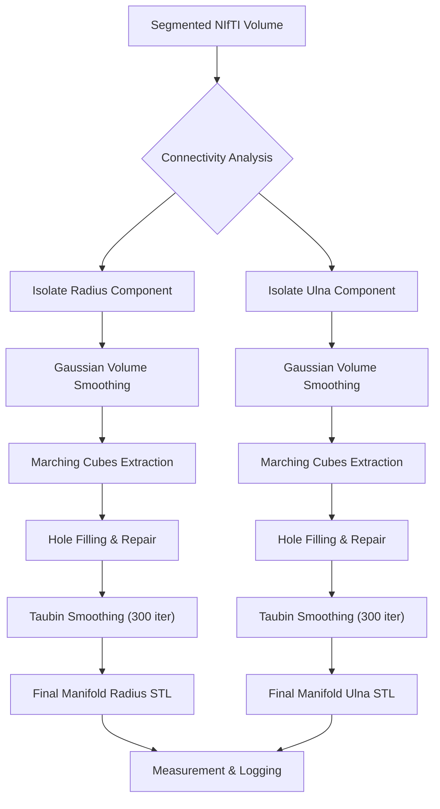

# 3D Image Reconstruction & Visualisation (202400339)

## Assignment 2: 3D Surface Reconstruction and Post-Processing of MRI Bone Segments

[](https://www.python.org/)
[](https://docs.pyvista.org/)
[](https://scikit-image.org/)

---

### 🚀 Keywords & Tags

`3D Reconstruction` `Marching Cubes` `Watertight Mesh` `Manifold` `Taubin Smoothing` `Hole Filling` `STL Export` `Radius-Ulna` `PyVista` `VTK` `Anatomical Modelling`

---

## Project Overview

This assignment focuses on the accurate transformation of pre-segmented MRI bone volumes into watertight 3D surface models. Utilizing existing binary masks of the **Radius** and **Ulna**, the pipeline implements a robust reconstruction workflow including Gaussian pre-processing, isosurface extraction, and advanced mesh refinement to ensure technical manifold integrity and precise anatomical representation.

---

## 🛠 Reconstruction Workflow

The process follows a structured pipeline from volumetric data to final manifold STL export:

### 1. Data Input & Pre-processing
- **Source**: `final_bone_mask_watershed.nii` (1mm isotropic resolution).
- **Component Isolation**: Used 3D connectivity analysis (`scipy.ndimage.label`) to isolate the Radius and Ulna as the two largest independent components.

### 2. Surface Extraction & Repair
- **Algorithm**: `skimage.measure.marching_cubes`.
- **Pre-processing**: Applied 3D Gaussian volume smoothing (`sigma=1.0`) to the binary mask to eliminate voxel discretization and bridge small surface gaps.
- **Hole Filling**: Used `mesh.fill_holes` to ensure the mesh is **watertight (manifold)** by closing any remaining surface discontinuities.
- **Orientation**: Used `auto_orient_normals` to ensure all faces point consistently outward.

### 3. Mesh Smoothing (Taubin Filter)
- **Method**: `mesh.smooth_taubin` (300 iterations, `pass_band=0.03`).
- **Rationale**: High-iteration Taubin filtering was used to achieve a smooth, refined surface finish. The Taubin method ensures this smoothing does not result in volume shrinkage or loss of anatomical length.

### 4. Mesh Decimation
- **Method**: No reduction (0%).
- **Rationale**: To ensure maximum surface fidelity and "watertight" integrity, the full resolution of the extraction was preserved.

---

## 📊 Summary of Results

Detailed reconstruction metrics for Project Group 1.

| Metric | Radius | Ulna |
|:--- |:--- |:--- |
| **Vertices (Final)** | 7,330 | 7,256 |
| **Faces (Final)** | 14,656 | 14,512 |
| **Watertight (Manifold)** | **Yes (True)** | **Yes (True)** |
| **Bone Length (mm)** | **162.95** | **176.23** |

*Note: Results verified against phantom reference dimensions.*

---

## 🔄 Workflow Flowchart



---

## 💻 How to Run

1. Ensure the segmentation mask is located at `final_bone_mask_watershed.nii`.
2. Install dependencies: `pip install pyvista vtk nibabel numpy pandas scikit-image`.
3. Run the reconstruction script:
   ```bash
   python reconstruct_3d.py
   ```
4. Outputs:
   - `ProjectGroup1_Checkpoint2_Radius.stl`
   - `ProjectGroup1_Checkpoint2_Ulna.stl`
   - `reconstruction_results.csv`

---

*Created for the Course: 3D Image Reconstruction & Visualisation (202400339)*
